# Nepotism Risk Analytics
Simulation-Driven HR Fairness Modeling with Predictive Analytics, Structural Risk Scoring, and Decision Diagnostics

---

## Motivation

I built this project to combine several analytical ideas that are often taught separately into one coherent system.

In industrial engineering, operations research, statistics, and analytics courses, it is common to study simulation, predictive modeling, inference, diagnostics, and decision analysis as disconnected techniques. What interested me was not using each method in isolation, but designing a framework where they reinforce one another.

This project started from a practical question:

How can we model the organizational impact of favoritism and nepotism in a way that is measurable, interpretable, and operationally meaningful?

Instead of treating favoritism as only a qualitative organizational issue, I wanted to express it through data-generating scenarios, model-driven decisions, structural risk metrics, suspicious-case detection, and comparative outcome analysis. That led to a platform where synthetic HR regimes can be generated, scored, compared, and inspected through a product-style interface.

For me, this project represents a shift from solving isolated analytical tasks to building a complete decision-support environment.

---

## Overview

Nepotism Risk Analytics is a synthetic HR analytics platform that models how relationship-driven decision-making affects:

- hiring quality
- promotion fairness
- structural concentration of connected employees
- suspicious low-merit or low-performance decisions
- scenario-level organizational outcomes

The repository combines:

- a Python analytics pipeline
- a FastAPI backend
- a static frontend web application
- exported model outputs and diagnostics

The system currently evaluates three HR regimes:

- Merit-based
- Moderate favoritism
- High nepotism risk

---

## Product Highlights

- Scenario-driven synthetic HR analytics pipeline spanning hiring, promotion, structural risk, and suspicious-case detection
- Local web application for prediction, analytical review, and cross-scenario comparison
- Persisted predictor bundles for fast startup without retraining on each launch
- Manager-level and department-level structural nepotism risk scoring
- Matched-pair and sensitivity analysis for model interpretability
- Organizational impact comparison across fairness, quality, efficiency, and structural exposure dimensions

---

## System Architecture

Data Generation -> Data Preparation -> Hiring Model -> Promotion Model -> Network Risk Model -> Suspicious Decision Scoring -> FastAPI Backend -> Web Dashboard

### Core Components

| Module | Responsibility |
| --- | --- |
| `src/generate_data.py` | Generates synthetic candidate and employee data across multiple HR regimes |
| `src/prepare_model_data.py` | Validates, transforms, and engineers model-ready datasets |
| `src/model_hiring.py` | Trains and evaluates candidate-level hiring models |
| `src/model_promotion.py` | Trains and evaluates employee-level promotion models |
| `src/model_network_nepotism.py` | Produces manager-level and department-level structural risk scores |
| `src/model_anomaly.py` | Flags suspicious hires and promotions based on merit/performance mismatch and connection signals |
| `backend/api.py` | Serves the local analytics web application through FastAPI |
| `frontend/` | Static product interface for prediction, comparison, and inspection |
| `app_utils/` | Shared helper layer for prediction, aggregation, dashboard data, and explanatory analytics |

---

## Application Walkthrough

The current product surface is designed as a lightweight local analytics platform rather than a notebook-only research artifact. The screenshots below show the primary workflows and analytical outputs exposed through the web application.

### Dashboard

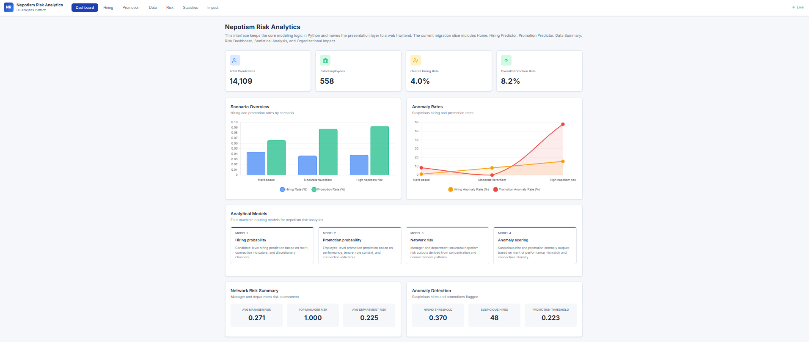

The dashboard acts as the product entry point, presenting the analytical scope of the platform through KPI cards, high-level scenario comparisons, and direct orientation across the four core model layers.

---

### Hiring Predictor

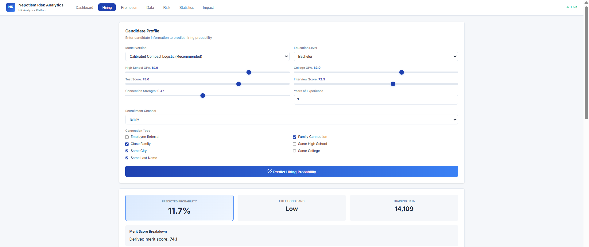

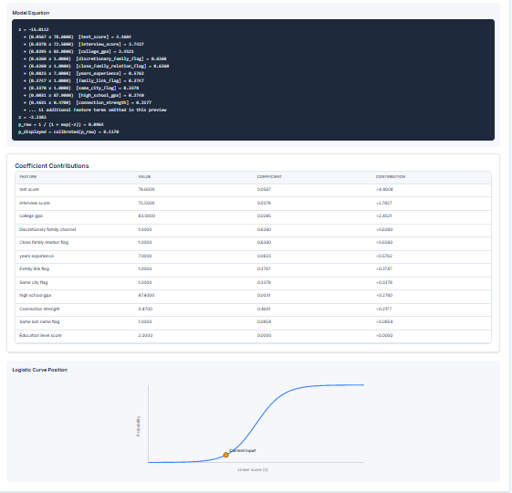

The hiring workflow provides candidate-level probability scoring using merit, connection, and discretionary-channel inputs. It is designed to support both demonstration and interpretability by combining live prediction with an explanation layer for the resulting decision profile.

---

### Promotion Predictor

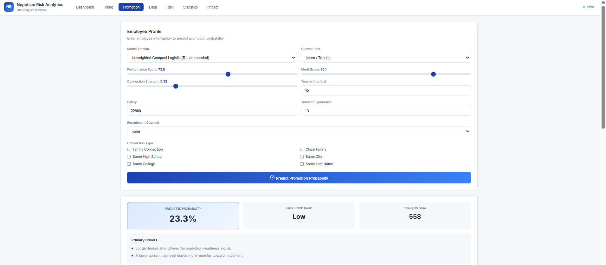

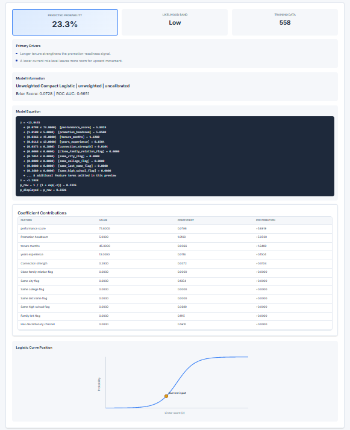

The promotion workflow mirrors the hiring predictor but shifts the decision context to employee performance, tenure, role, salary, and connection signals. This keeps the user experience consistent while reflecting the different structure of internal advancement decisions.

---

### Data Summary

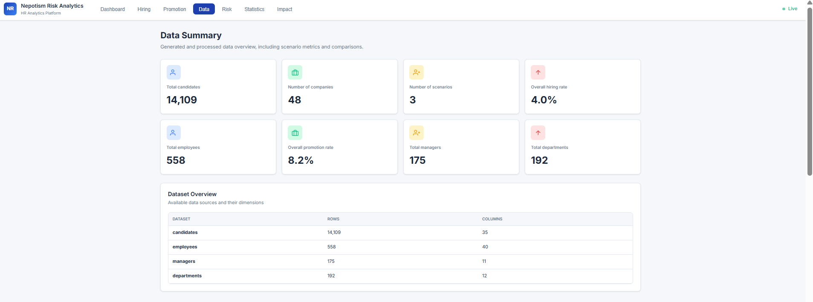

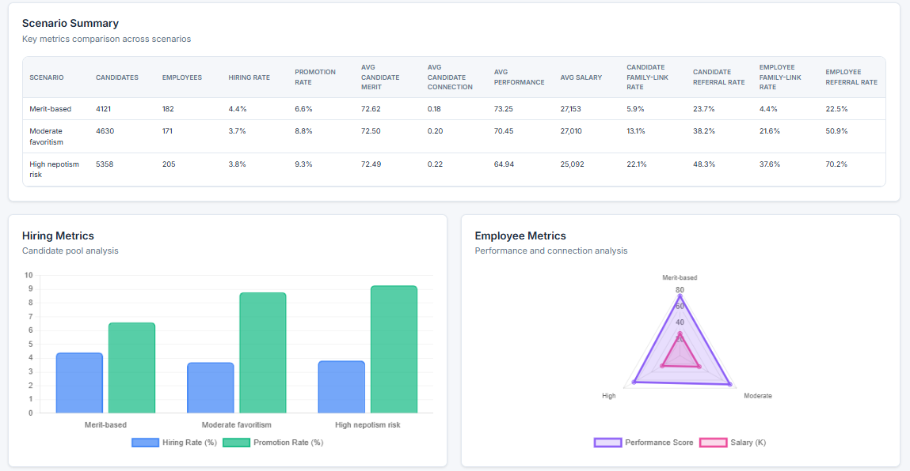

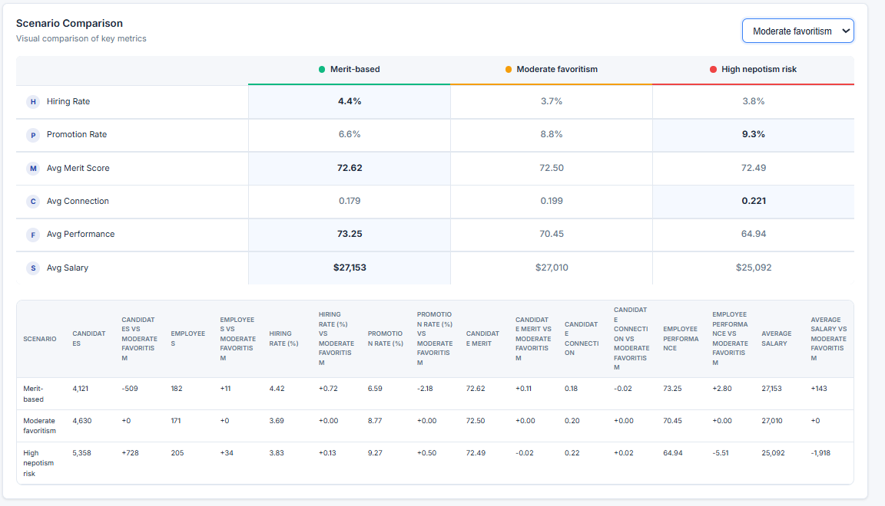

The Data Summary page provides a descriptive foundation for the rest of the application. It combines dataset dimensions, scenario-level metrics, comparative tables, and visual summaries so users can understand how the synthetic HR regimes differ before interpreting model outputs.

---

### Risk Dashboard

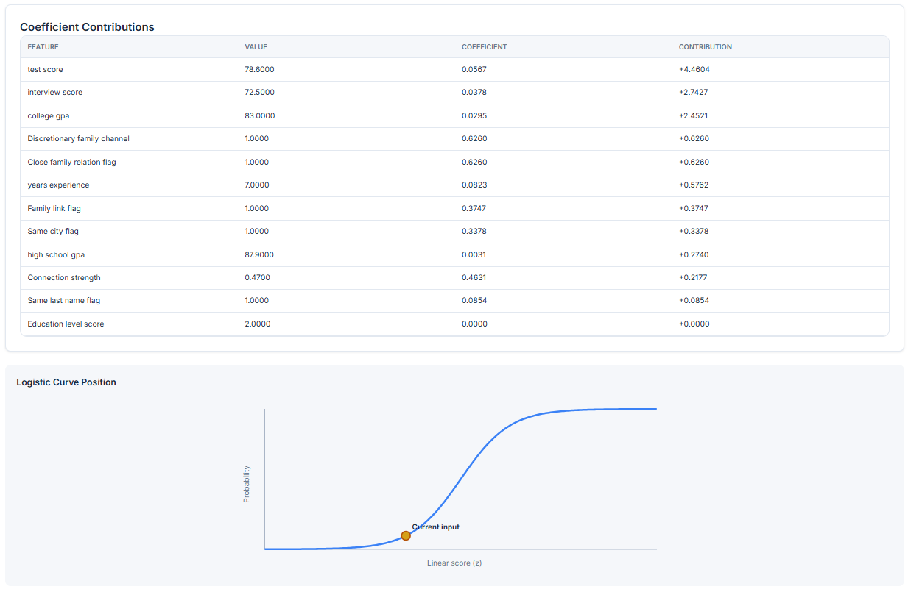

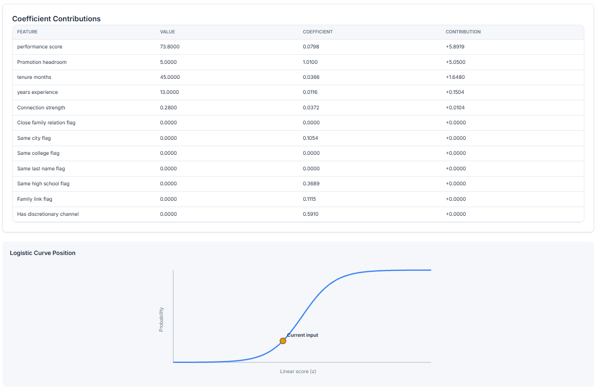

The Risk Dashboard focuses on Model 3 and Model 4 outputs. It surfaces structural concentration patterns at manager and department level while also highlighting suspicious hires and promotions for audit-style analytical review.

---

### Statistical Analysis

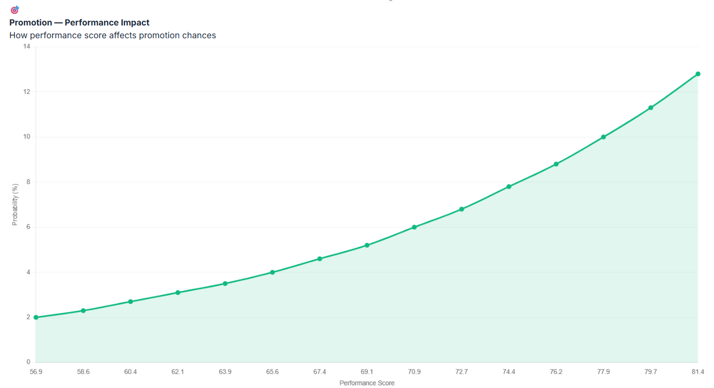

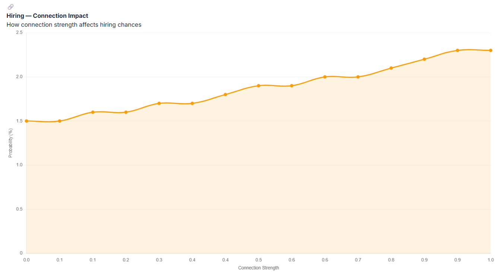

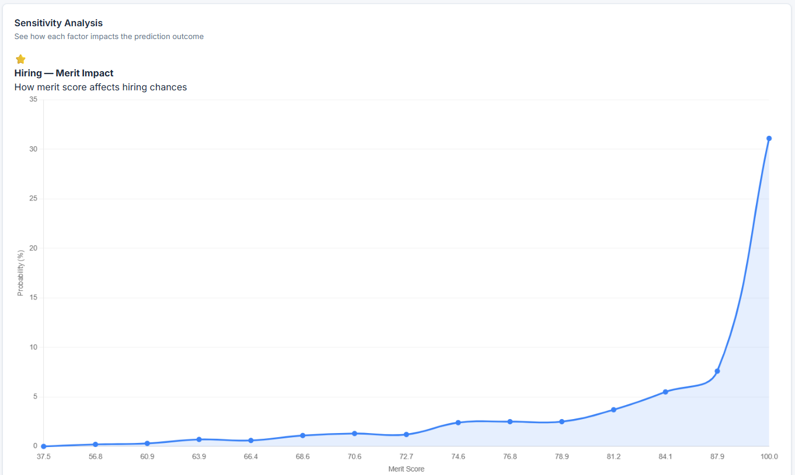

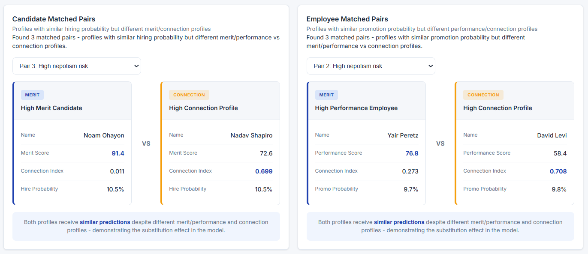

The Statistical Analysis view adds model-behavior interpretation on top of prediction and ranking outputs. It uses matched pairs and one-variable-at-a-time sensitivity curves to show how similar predicted probabilities can arise from very different merit and connection profiles.

---

### Organizational Impact

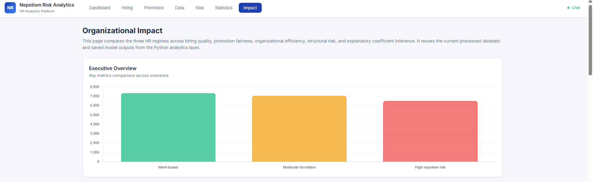

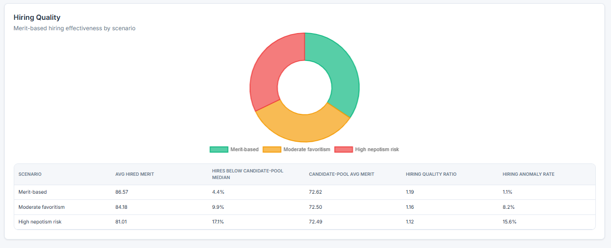

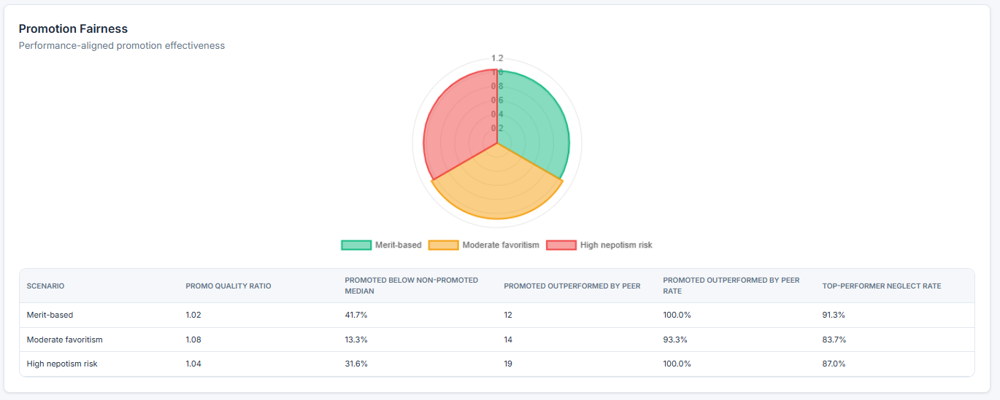

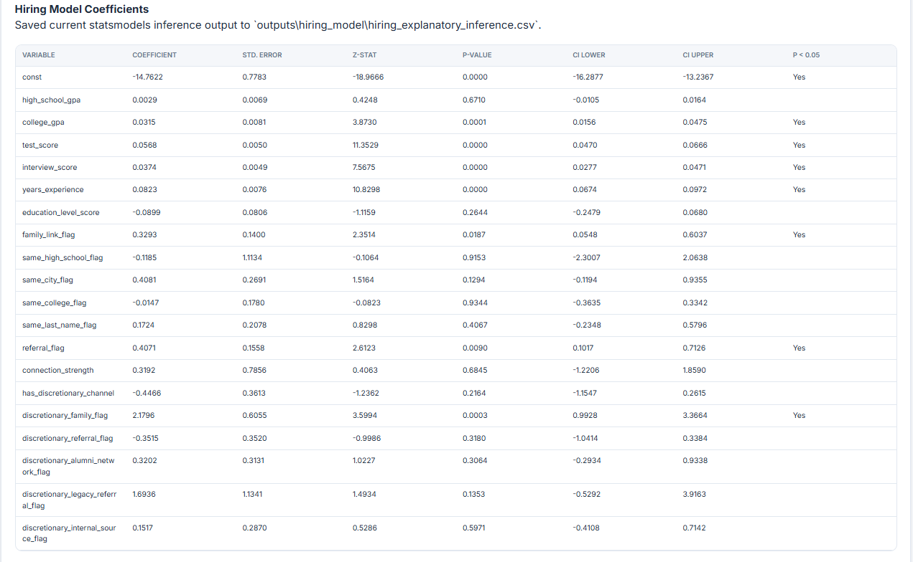

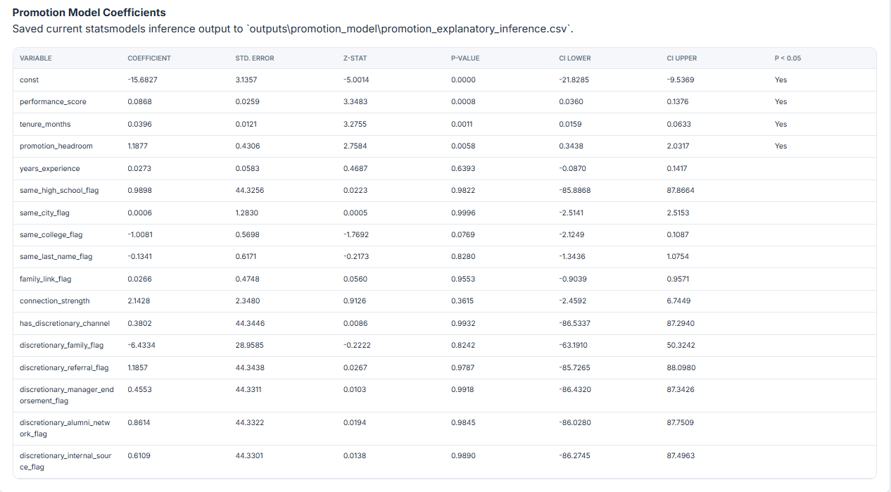

The Organizational Impact page translates model outputs into scenario-level business and governance consequences. It compares hiring quality, promotion fairness, proxy efficiency, structural risk, and explanatory coefficient results in one integrated decision-support surface.

---

## Analytical Framework

### 1. Hiring Model

The hiring model estimates candidate selection probability using combinations of:

- education level
- GPA and assessment scores
- interview performance
- years of experience
- referral and relationship indicators
- connection strength
- discretionary recruitment channels

This model supports both predictive use in the web interface and analytical comparison across HR scenarios.

### 2. Promotion Model

The promotion model estimates employee promotion probability using:

- performance score
- tenure
- role level
- salary context
- years of experience
- connection indicators
- discretionary advancement signals

### 3. Network Nepotism Risk Model

This model evaluates structural exposure by generating manager-level and department-level risk scores from concentration and connectedness patterns in the employee population.

It is intended to capture organizational structure, not only individual prediction.

### 4. Suspicious Decision Scoring

The anomaly layer highlights suspicious hires and promotions in cases where weak merit or weak performance appears alongside stronger connection-related indicators.

This makes the system useful not only for prediction, but also for audit-style analytical review.

---

## Scenario Design

The current pipeline compares three regimes with different decision logic:

### Merit-based

- hiring is driven primarily by merit
- promotion is driven primarily by performance and tenure
- connection effects are weak

### Moderate favoritism

- merit remains important
- connected candidates and employees gain some advantage
- organizational quality begins to diverge from purely merit-based outcomes

### High nepotism risk

- relationship signals exert strong influence
- connected profiles gain outsized advantage
- structural concentration and suspicious outcomes increase materially

These scenarios change the data-generating process itself rather than simply acting as labels.

---

## Web Application Modules

The local product currently includes:

- **Dashboard**: high-level orientation and KPI summary
- **Hiring Predictor**: candidate-level prediction workflow
- **Promotion Predictor**: employee-level prediction workflow
- **Data Summary**: descriptive and comparative scenario view
- **Risk Dashboard**: structural risk and suspicious-case review
- **Statistical Analysis**: matched-pair interpretation and sensitivity analysis
- **Organizational Impact**: comparative quality, fairness, efficiency, and risk outcomes

---

## Repository Structure

```text
.
|-- app_utils/                 Shared helper layer for the app and analytics views
|-- artifacts/
|   `-- predictor_models/      Persisted hiring and promotion bundles
|-- backend/                   FastAPI service layer
|-- data/
|   |-- generated/             Synthetic source workbook
|   `-- processed/             Model-ready datasets
|-- docs/                      Notes, roadmap references, and application screenshots
|-- frontend/                  Static frontend served by FastAPI
|-- outputs/
|   |-- anomaly_model/         Suspicious-case outputs and anomaly summaries
|   |-- hiring_model/          Hiring metrics, predictions, coefficients, and plots
|   |-- network_model/         Structural risk outputs
|   `-- promotion_model/       Promotion metrics, predictions, coefficients, and plots
|-- src/                       Core data generation and modeling scripts
|-- requirements.txt
`-- Run_Nepotism_Web_App.bat
```

---

## Technology Stack

- Python
- FastAPI
- Uvicorn
- Pandas
- NumPy
- scikit-learn
- statsmodels
- matplotlib
- openpyxl
- networkx
- Faker
- Vanilla JavaScript
- CSS

---

## Getting Started

### Prerequisites

- Python 3.11 or newer recommended
- Windows environment for the included launcher script

### Installation

```powershell
python -m venv .venv
.venv\Scripts\Activate.ps1
pip install -r requirements.txt
```

### Run the Web Application

Option 1:

```powershell
.\Run_Nepotism_Web_App.bat
```

This launcher starts the FastAPI server and opens the application in Chrome, or in the default browser if Chrome is not available in a standard Windows install path.

Option 2:

```powershell
.venv\Scripts\python.exe -m uvicorn backend.api:app --host 127.0.0.1 --port 8000
```

Then open:

```text
http://127.0.0.1:8000
```

---

## Data and Modeling Workflow

The current workflow is:

1. Generate synthetic candidate and employee data under multiple HR regimes
2. Prepare processed datasets and engineered features
3. Fit and evaluate hiring and promotion models
4. Compute structural manager and department risk scores
5. Score suspicious hiring and promotion outcomes
6. Serve the outputs through the local web application

---

## Analytical Outputs

The repository already includes saved outputs for demonstration and inspection, including:

- hiring metrics
- promotion metrics
- explanatory coefficient tables
- candidate and employee prediction outputs
- ROC and precision-recall charts
- risky manager and department rankings
- suspicious hires and suspicious promotions
- scenario-level anomaly summaries

These artifacts make the repository presentation-ready even without rerunning the full pipeline immediately.

---

## Interpretation and Research Value

This system is intended as a decision-support and analytical experimentation platform.

Its value comes from combining:

- synthetic scenario design
- predictive modeling
- structural concentration scoring
- suspicious-case detection
- comparative organizational interpretation

Rather than treating favoritism as a purely descriptive concept, the platform operationalizes it into measurable analytical outputs that can be compared under controlled scenario assumptions.

---

## Roadmap

Planned next steps include:

- batch upload and export workflows for prediction pages
- deeper filtering and exploration in the web interface
- expanded dashboard controls for structural risk and suspicious-case inspection
- a full multi-period workforce simulation engine based on the design in `docs/simulation.txt`

---

## Important Notes

- The data in this repository is synthetic and intended for analytical experimentation and demonstration.
- The current application is a local product surface, not a hosted production deployment.
- Some files in `outputs/anomaly_model/` reflect legacy artifacts from earlier iterations and should be interpreted alongside the current active pipeline.

---

## Author

**yoavne26-hub**  
yoavne26@gmail.com  
[LinkedIn](https://www.linkedin.com/in/yoav-nesher)

---

